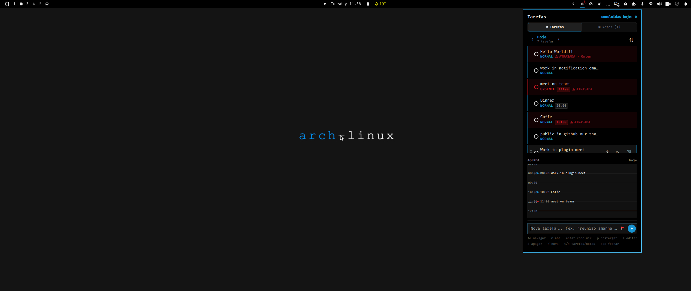
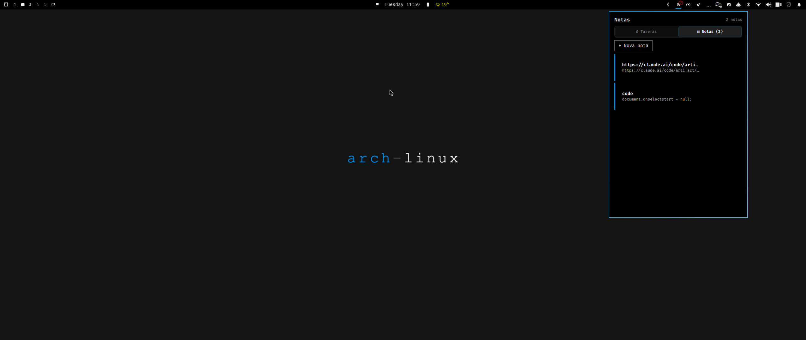

# omatask

A local task list and notes bar widget for [Omarchy](https://omarchy.org). Day-by-day task navigation, drag reorder, priorities, a day-agenda timeline, and plain-text notes — nothing leaves the machine.




## Features

- **Day-by-day tasks** — navigate any date with ‹ ›, not just fixed "today/tomorrow" tabs. "Hoje" (Today) also rolls forward every still-open task left behind on an earlier day, so nothing quietly falls through the cracks — it stays a visible pendency until you complete, postpone, or delete it.
- **Type dates and times inline** — typing "reunião amanhã 15h" in the composer detects the date/time from the text itself, no picker click required (a 📅/🕐 picker is also there if you prefer clicking).
- **Priorities** (Urgente / Normal / Pode esperar) shown as a color stripe, plus a one-shot "organize by priority" action — never a standing auto-sort that fights your manual drag order.
- **Manual drag-to-reorder** for both tasks and notes.
- **Day-agenda timeline** for whichever day you're viewing, with a live "now" line.
- **Notes** — free-text cards (title + body), copy-to-clipboard, drag reorder. Rendered strictly as plain text (`Text.PlainText`/`TextEdit.PlainText`) — pasted content is never interpreted as HTML, so a note can never trigger an image fetch or other markup side effect.
- **A real dissolve-then-remove animation** (`QtQuick.Particles`) on complete/delete.
- **Fully local** — state lives at `~/.local/state/omarchy/<plugin-id>/{tasks,notes}.json`. No network calls, no backend.
- **Multi-monitor safe** — state is owned by a single shared `service` (not duplicated per bar instance), so a task added from one monitor's popup shows up identically on every other monitor's.

## Requirements

- `wl-copy` (from `wl-clipboard`) — used for the note "copy" action. Present by default on Omarchy.
- `python3` — runs `statehelper.py`, a small subprocess this plugin shells out to for loading/saving `tasks.json`/`notes.json`. It exists because QML/JS has no syscall access: the helper opens the state directory once with `O_NOFOLLOW`, does every read/write relative to that held directory descriptor, and writes via a private temp file + `fsync` + atomic rename, so a symlink or FIFO swapped into that directory can't be followed or block the process. Present by default on Omarchy/Arch.

## Install

```bash
omarchy plugin add https://github.com/osungjinwoo/omatask.git --enable
```

Or manually:

```bash
git clone https://github.com/osungjinwoo/omatask.git ~/.config/omarchy/plugins/io.github.osungjinwoo.omatask
omarchy plugin enable io.github.osungjinwoo.omatask
```

## Uninstall

```bash
omarchy plugin remove io.github.osungjinwoo.omatask
```

This removes the plugin from `~/.config/omarchy/plugins/` and takes it out of the bar. It does not delete your saved tasks/notes at `~/.local/state/omarchy/io.github.osungjinwoo.omatask/` — remove that directory yourself if you also want the data gone.

## Keyboard shortcuts (panel open)

```
↑↓ navigate   ↔ switch day   enter complete   p postpone   e edit
d delete      / new task     t/n tasks/notes  esc close
```

## License

MIT — see [LICENSE](LICENSE).
